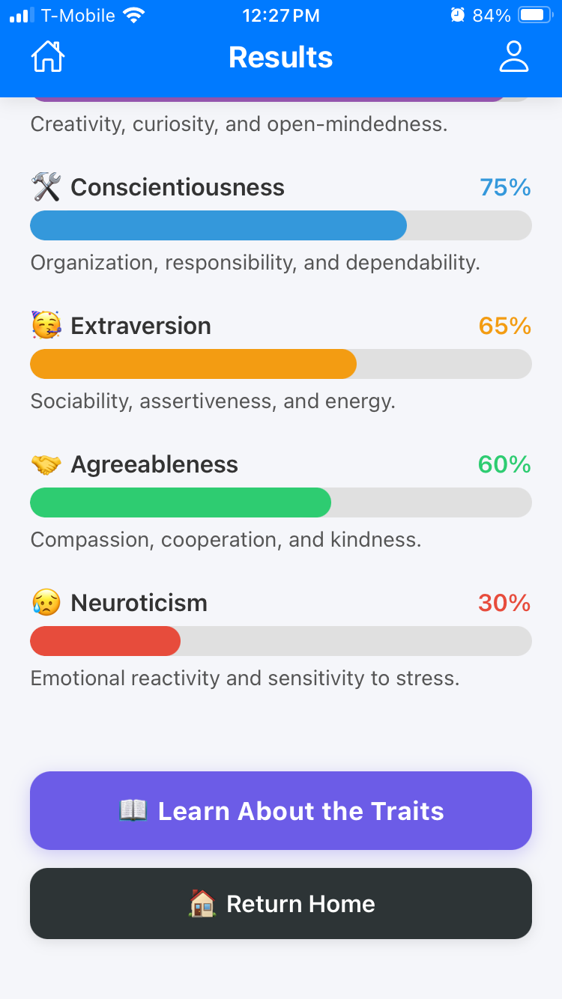
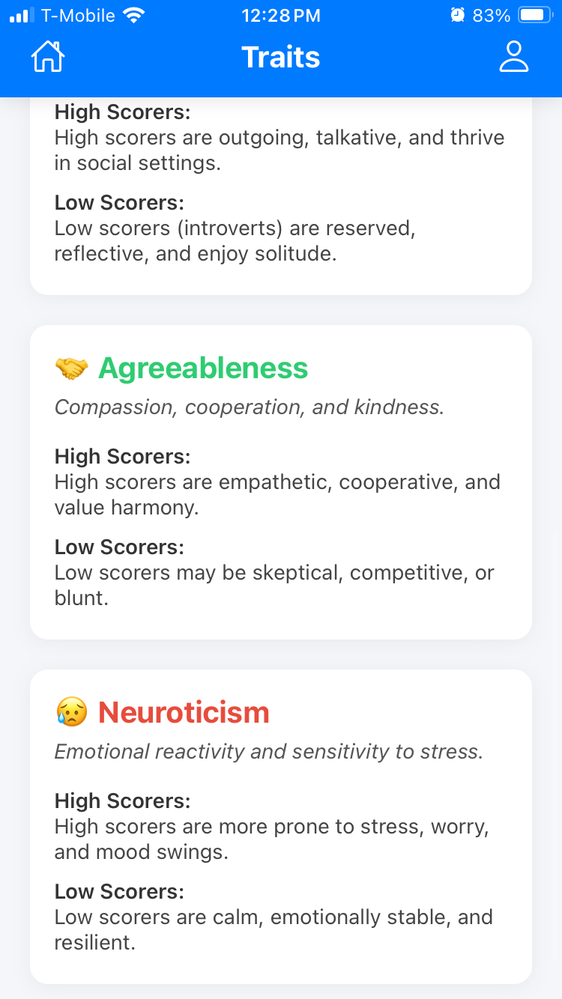

# 🧠 Personality Test Mobile App

Welcome to the **Personality Test Mobile App**, a custom-designed React Native app that helps users explore their personalities through the Big Five personality traits (OCEAN model).

## 🚀 Features

- 📊 Take a 50-question Big Five personality test (O, C, E, A, N)
- 🎨 Clean, intuitive interface with a smooth quiz experience
- 📘 Learn about the traits and your strengths with friendly visuals
- 👤 Create an account and view your results history
- 📱 Responsive layout designed for mobile
- 🔒 Firebase authentication and Firestore database integration

## 📷 Screenshots

<div style="display: flex; flex-wrap: wrap; gap: 10px;">
  
  
  
  
  
  
  
  
  
  
  
</div>

## 🛠️ Tech Stack

- **React Native** with Expo
- **Firebase** (Auth + Firestore)
- TypeScript & React Navigation
- Styled with React Native `StyleSheet`

## 🧪 How to Run Locally

```bash
git clone https://github.com/ECampbell37/PersonalityTestMobileApp.git
cd PersonalityTestMobileApp
npm install
npx expo start
```

Make sure you have Expo CLI installed: `npm install -g expo-cli`

## 📁 Folder Structure

```
/screens       → All screen components (Test, Results, Welcome, etc.)
/src           → Firebase config and question logic
/assets        → App images and icons
/screenshots   → Screenshots for README
```

---

Made by [Elijah Campbell-Ihim](https://github.com/ECampbell37) for my Mobile Development Course

---
